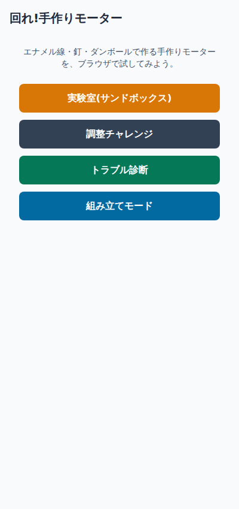
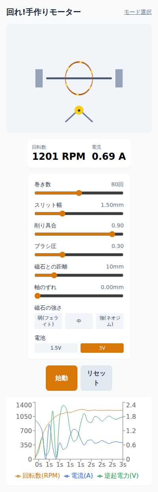
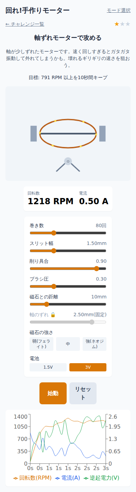
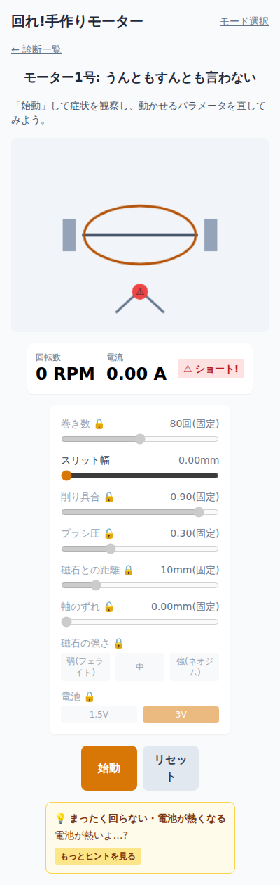
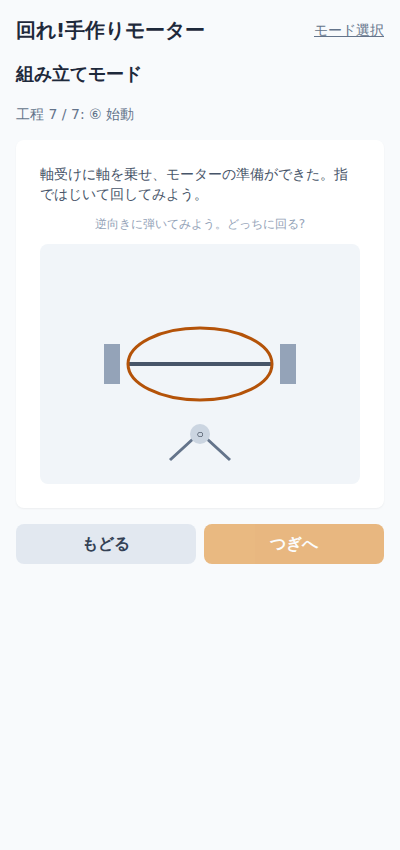

# 回れ!手作りモーター

中学理科の定番工作「エナメル線・釘・ダンボール・クリップで作る手作りDCモーター」を、ブラウザ上で追体験できる教育ゲームです。整流子のショート、削り残しによる接触抵抗、ブラシ圧の強すぎ/弱すぎ、巻き数不足――実物の工作でつまずくポイントを、そのまま調整可能なパラメータとして提示し、「なぜ回らないのか」を試行錯誤で学べることを目指しています。

対象は中学生とその保護者です。物理エンジンは実物のDCモーターの方程式(整流・逆起電力・摩擦・接触不良など)を数値積分しており、見た目だけのシミュレーションではありません。



## 4つのモード

### 実験室(サンドボックス)

全パラメータ(巻き数・スリット幅・削り具合・ブラシ圧・磁石の強さ/距離・電池電圧・軸のずれ)を自由に操作し、RPM・電流・逆起電力のグラフをリアルタイムで観察できます。物理エンジンの挙動を確かめる開発ツールも兼ねています。



### 調整チャレンジ

いくつかのパラメータが固定された「縛り」つきのモーターで、目標回転数を10秒間キープすることを目指します。ただ最大速度を出すだけでなく、壊れない・ブレない範囲を見極める緊張感が核になっています。☆1(目標達成)・☆2(安定持続)・☆3(効率)の3段階評価。



### トラブル診断

「回らないモーター」が渡されます。動かせるパラメータは1つだけ。実際に動かして症状を観察し、原因を特定して直すと「なおった!」になります。



### 組み立てモード

実物の工作と同じ6つの工程(コイル巻き→軸の固定→整流子作り→台座作り→組み立て→始動)を、1つずつジェスチャー操作で追体験します。最後は画面を指ではじいてモーターを始動させます。



## 遊び方のヒント

- 数値をいじる前に、まず「実験室」で各スライダーを動かして、モーターの動き・電流・逆起電力がどう変わるかを眺めてみてください
- 「調整チャレンジ」は、固定されたパラメータ以外を工夫して、10秒間安定して目標回転数を保つのが目標です。速すぎると軸がガタついて失敗することがあります
- うまく回らないときは、画面に出るヒントを読みながら原因を絞り込んでください(答えはすぐには出ません)

## ローカルで動かす

```bash
npm install
npm run dev      # 開発サーバー起動
npm run test     # 物理エンジンのテスト(Vitest)
npm run build    # 型チェック + 本番ビルド
npm run sweep    # チャレンジ設計用のパラメータグリッド探索ツール(開発用)
```

Node.js 20以上を推奨します。バックエンドを持たない完全な静的サイトです。

## 技術スタック

Vite / React 18 + TypeScript / zustand / Canvas 2D / recharts / Tailwind CSS / Vitest

物理エンジン(`src/engine/`)はReact・DOMに一切依存しない純粋なTypeScript関数として実装されており、Vitestで数値的にユニットテストしています。詳細な仕様は `docs/spec.md` を参照してください。
