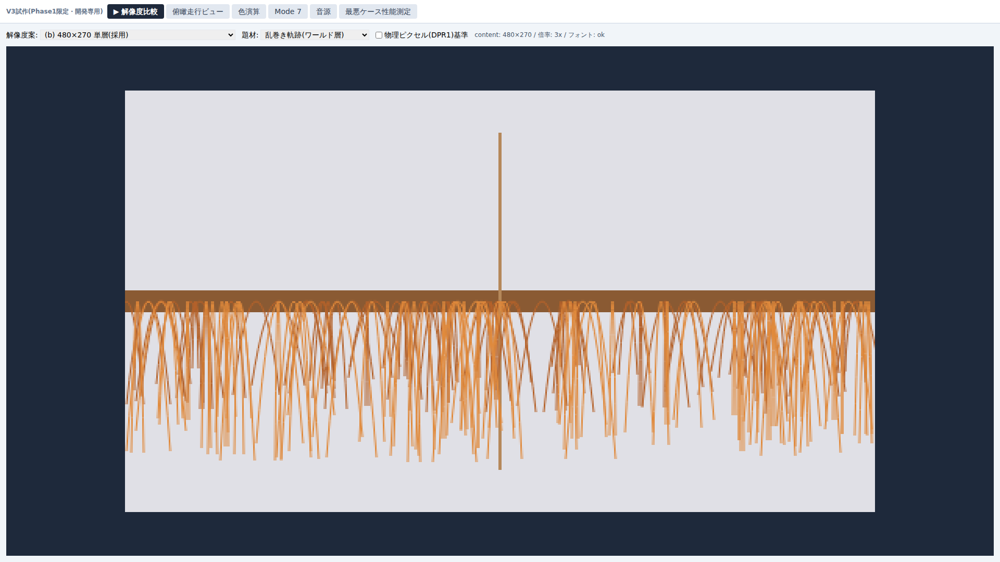
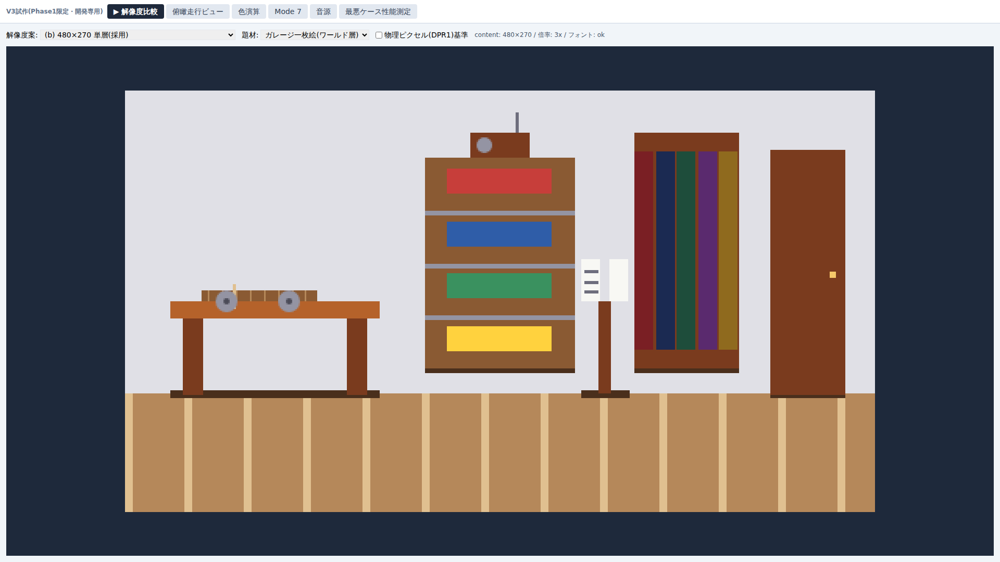
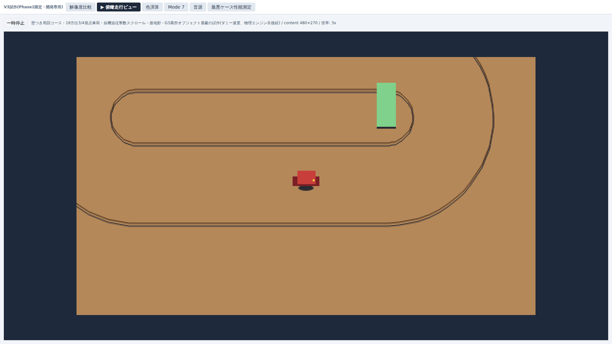
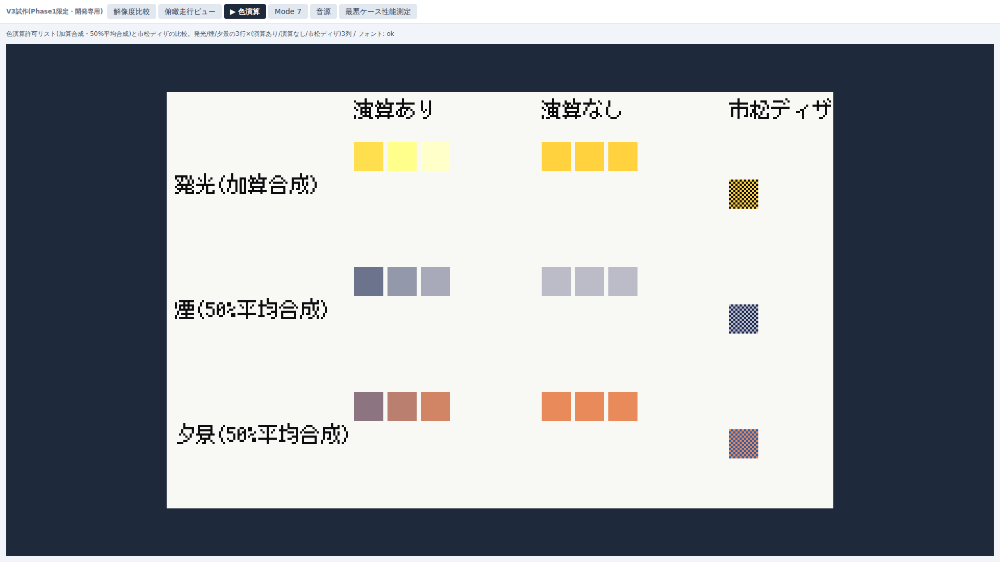
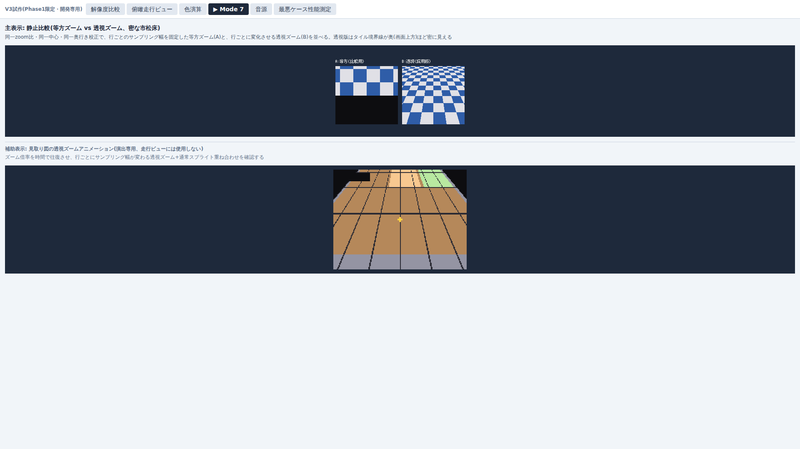
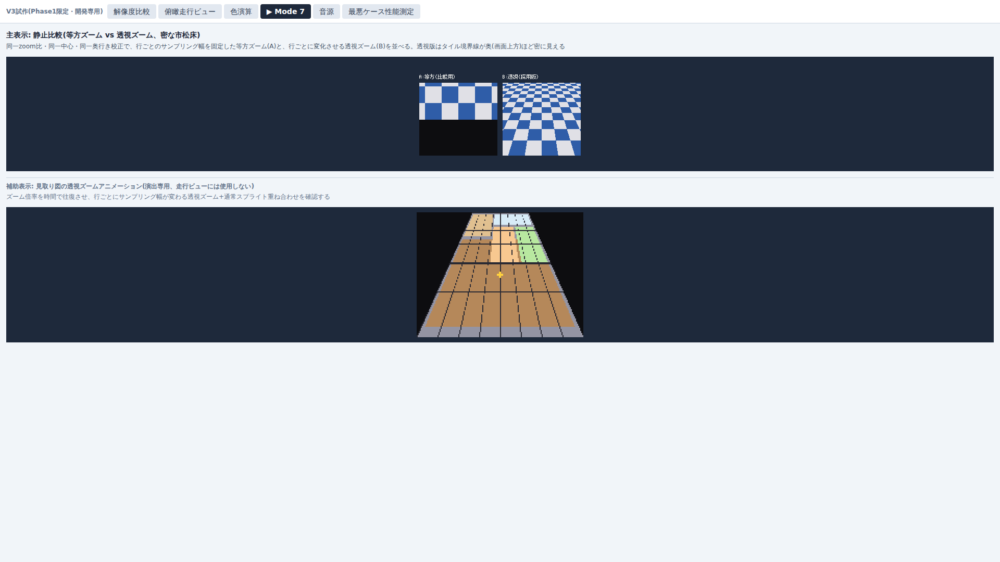

# Phase 1 統合美術レビュー資料(PHASE1-ART-REVIEW)

作成日: 2026-07-22 
担当: brabit(UI・描画・音) 
レビュー窓口: Suu 
人間承認: 2026-07-22・全16項目合格 
実費: 0 USD

このドキュメントは`docs/phase1-plan.md` §1のPhase 1ゲート「試遊で解像度承認+画面スクショ美術レビュー運用の開始」のうち、後半(美術レビュー運用)にあたる統合レビュー資料である。内部解像度480×270単層(確定済み、`docs/phase1-resolution-comparison.md`)での各題材の見た目を、無加工スクリーンショットで人間に問う。

## 1. 撮影条件

| 項目 | 値 |
|---|---|
| 対象HEAD | `d73c32f`(`feat(retro-proto): 乱巻きとガレージの美術レビュー題材を改善 [brabit]`。撮影時点のHEADそのもの、以降のcommitなし) |
| 内部解像度 | 480×270単層(確定済み) |
| ブラウザ | Playwright経由Chromium(Chrome for Testing) 149.0.7827.55(Playwright 1.61.1、新規npm依存なし) |
| CSS viewport | 1920×1080、devicePixelRatio: 1、ブラウザズーム100%相当 |
| セッション | 乱巻き・ガレージ・俯瞰走行・色演算・Mode7を同一ブラウザセッション内で連続撮影 |
| 検死レポート | 今回のコード変更なし。既存Unit D証拠[unit-d-b-autopsy.png](phase1-submission/resolution/unit-d-b-autopsy.png)への参照で足りるため再撮影していない(Suu承認) |

## 2. 乱巻き軌跡(Task#WINDING-AGE-RADIUS適用後)

新旧ターンの明度差を、armOffset(左右偏り)ではなく半径方向の包絡(古いターン=内層・小さい包絡、新しいターン=外層・現行最大包絡)で表現するよう修正した。

- [x] 150ターンが「良い汚さ」として読める(単純な塗りつぶしに見えない)
- [x] 新旧の色分け(内層=暗色/外層=明色)が視認できる
- [x] 逆巻き区間による左右の乱れが不自然でない

## 3. ガレージ一枚絵(Task#GARAGE-DENSITY適用後)

カタログ(棚と本棚の間の専用スタンド)・ラジオ(棚の上)・接地影5箇所・正典機の素材感(段ボール中芯・爪楊枝軸・釘頭)を追加した。

- [x] 机・棚・カタログ・本棚・ドア・ラジオの6要素がそれぞれ何の入口か読める
- [x] 接地影により各家具が床に接している感じが出ている
- [x] 正典機(机上の段ボール台座+爪楊枝軸)の素材感が伝わる
- [x] 全体の描き込み密度が「スーファミ級拠点画面」の目安に近づいたと感じるか(参考: 密度改善前の状態が必要であれば`docs/phase1-resolution-comparison.md`のunit-d-b-garage.png等を比較用に参照可能)

## 4. 俯瞰走行ビュー(車体拡大後)

壁つき周回コース・16方位3/4視点マシン・自機追従スクロール・接地影・G3高所オブジェクトによる遮蔽の試作。車体サイズは拡大済み(PHASE1-REVIEW-FIX、コミット`30a0671`)。

- [x] 壁・コースの輪郭が読める
- [x] 車体サイズが適切に見える(小さすぎない)
- [x] G3高所オブジェクト(緑の縦長オブジェクト)による遮蔽が機能して見える
- [x] 接地影が不自然でない

## 5. 色演算(発光・煙・夕景)

加算合成(発光)・50%平均合成(煙・夕景)と市松ディザの比較(2026-07-21の人間レビューで既に合格判定済み、参考として再掲)。

- [x] 発光(加算合成)が演算なし版と明確に違って見える
- [x] 煙(50%平均合成)が演算なし版と明確に違って見える
- [x] 夕景(50%平均合成)が演算なし版と明確に違って見える

## 6. Mode 7(ズーム変化率同期後)

静止比較(等方ズームA vs 透視ズームB)と、補助アニメーション(見取り図ズーム往復)の異なる2瞬間(ズームイン側・ズームアウト側)。縦横のズーム変化率同期修正(コミット`a66753f`、Suuコードレビュー・人間目視とも予備合格済み)を適用済み。

- [x] 透視ズーム(B)が等方ズーム(A)と比べて「傾いて奥行きがある」ように見える
- [x] 補助アニメーションのズームイン/ズームアウトで見取り図の奥行き表現が破綻していない

## 7. 結果

**人間承認: 2026-07-22、全16項目合格**(乱巻き3項目・ガレージ4項目・俯瞰走行4項目・色演算3項目・Mode 7 2項目、原文「すべてOK」)。

これにより、`docs/phase1-plan.md` §1のPhase 1ゲート「試遊で解像度承認+画面スクショ美術レビュー運用の開始」のうち後半(画面スクショ美術レビュー運用の開始)が**達成**した。前半(解像度承認)は`docs/phase1-resolution-comparison.md`で2026-07-22に完了済みのため、Phase 1ゲート全体が2026-07-22付で達成となる(ただし、これはPhase 1の全作業完了を意味しない。マスターパレット最終値・サンプルベース音源の技術検証など、art-spec冒頭チェックリストの残項目は引き続き未完了)。

## 8. 実施後のリポジトリ状態

本資料・画像は人間承認後、Suu指示の2論理単位(A: 本資料+art-review画像6枚、B: art-spec.md+spec.md+phase1-report.mdの正本・進捗反映)でcommitする。

