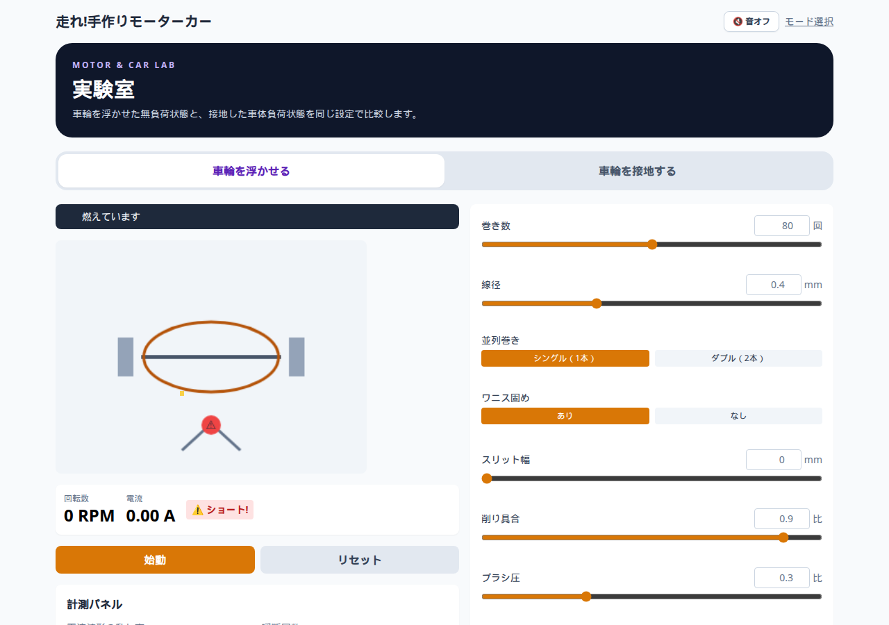
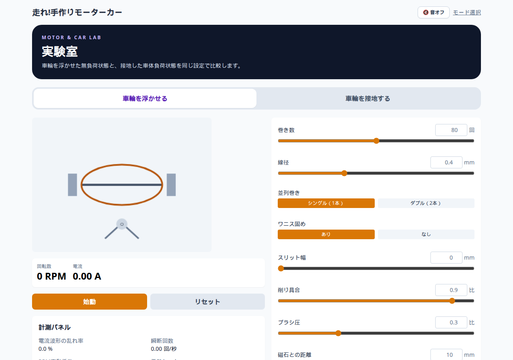
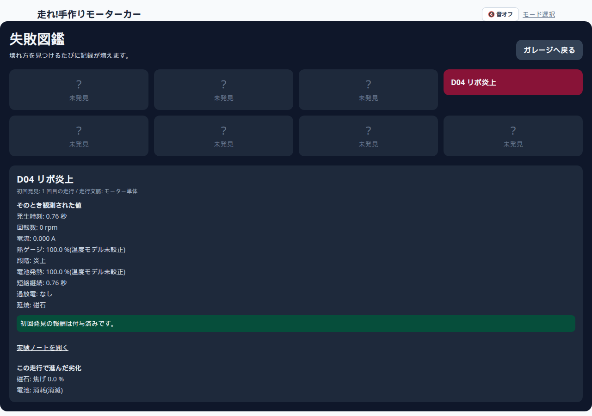

# G8 D04 終端演出の画面確認

対象: `codex/g8-terminal-presentation-debug-handoff` / `2bf3a58`

- 正例: PASS（停止後に HUD「燃えています」と炎粒子が残る）
- 負例: PASS（リセット後に消える）
- 図鑑: `D04 リポ炎上` 登録、発生時刻 0.76 秒
- Console 赤エラー: なし
- 音は未確認

## 画像

| ファイル | 内容 |
|---|---|
| [04-after-stop-1-full.png](./04-after-stop-1-full.png) | 停止後の実験室全体。HUDと炎 |
| [04-after-stop-1.png](./04-after-stop-1.png) | 停止後 1枚目（HUD＋モーター） |
| [04-after-stop-2.png](./04-after-stop-2.png) | 停止後 2枚目 |
| [04-after-stop-3.png](./04-after-stop-3.png) | 停止後 3枚目 |
| [05-after-reset-full.png](./05-after-reset-full.png) | リセット後。HUD・炎なし |
| [06-codex-d04-detail.png](./06-codex-d04-detail.png) | 失敗図鑑の D04 |

